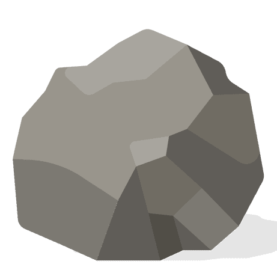
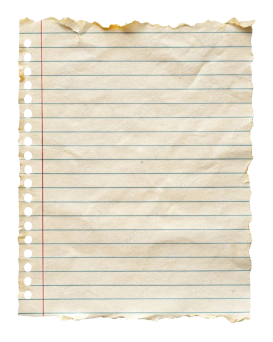
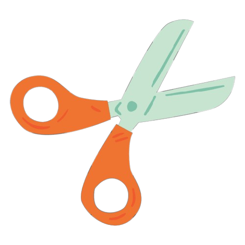

# Rock Paper Scissors Game

Game location: `$HOME/apps/rcp_game/`

---

## File Structure

```
rcp_game/
├── media/              (images)
│   ├── rock.png
│   ├── paper.png
│   ├── scissors.png
│   └── game.png        (background)
│
├── scripts/            (JavaScript)
│   ├── game.js         (game logic - you)
│   └── script.js
│
├── html/               (HTML pages)
│   ├── index.html      (landing page)
│   └── game.html       (main game)
│
├── css/                (Stylesheets)
│   ├── game.css
│   └── style.css
│
└── README.md
```

---

## game.html Structure

```html
<body>
    <div class="container">
        <!-- Title -->
        <h1 class="title">Rock Paper Scissors</h1>

        <!-- Rounds Input -->
        <div class="rounds-input">
            <label for="round-number">Rounds</label>
            <button class="round-btn" id="decrease">−</button>
            <input id="round-number" type="text" value="3" readonly>
            <button class="round-btn" id="increase">+</button>
        </div>

        <!-- Game Area -->
        <div class="game-area">
            <div class="player">
                <span class="player-name">Andrew</span>
                <div class="choice-box">
                    
                </div>
                <span class="score-value" id="bot-score">0</span>
            </div>

            <div class="vs">VS</div>

            <div class="player">
                <span class="player-name">You</span>
                <div class="choice-box">
                    
                </div>
                <span class="score-value" id="user-score">0</span>
            </div>
        </div>

        <!-- Choice Buttons -->
        <div class="choices">
            <button class="choice-btn" data-choice="rock">
                
            </button>
            <button class="choice-btn" data-choice="paper">
                
            </button>
            <button class="choice-btn" data-choice="scissors">
                
            </button>
        </div>

        <!-- Result Text -->
        <p class="result" id="result-text">Choose your move!</p>
    </div>
</body>
```

---

## CSS Elements

| Class | Description |
|-------|-------------|
| `.container` | Main wrapper, max-width 900px |
| `.title` | Game title, 3rem, red color |
| `.rounds-input` | Flexbox row for rounds controls |
| `.round-btn` | Increment/decrement buttons (− / +) |
| `.game-area` | Flexbox row for player displays |
| `.player` | Column flex for each player |
| `.choice-box` | 150x150 box showing current choice image |
| `.choice-btn` | Circular buttons for rock/paper/scissors |
| `.result` | Text area for game results |

---

## Background

Uses `game.png` with dark overlay:
```css
background: linear-gradient(rgba(0, 0, 0, 0.6), rgba(0, 0, 0, 0.6)),
            url("game.png");
background-size: cover;
background-position: center;
```

---

## JavaScript Elements to Handle

- `#decrease` - click to decrement rounds (min: 1)
- `#increase` - click to increment rounds (max: 8)
- `#round-number` - display current rounds value
- `.choice-btn` - click to select rock/paper/scissors
- `#bot-choice` - update bot's displayed choice
- `#user-choice` - update user's displayed choice
- `#bot-score` - update Andrew's score
- `#user-score` - update player's score
- `#result-text` - show round result ("You win!", "Andrew wins!", "Draw!")